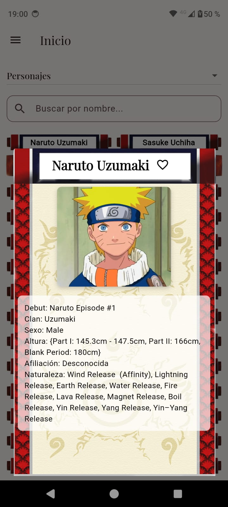
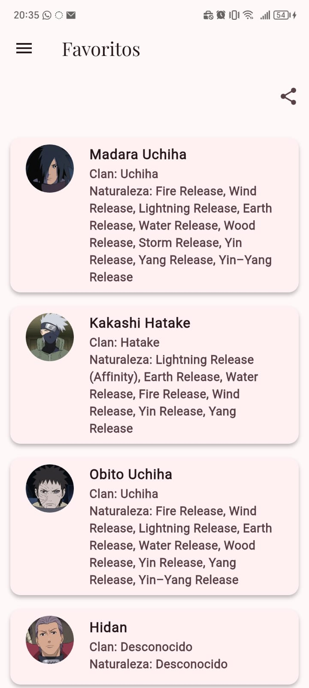

# ESENCIA: Tu enciclopedia para personajes del Universo de Naruto

ESENCIA es una aplicación movil desarrollada con flutter que consume una API de naruto para mostrar información relacionada con los personajes dentro del Universo del Anime, Consumiendo información directamente desde la Dattebayo API.

## Características Principales

Exploración: Navega a través de los multiples personajes de la serie.

Búsqueda y filtro: Encuentra rapidamente a tu personaje gracias a la función de búsqueda por nombre en cada categoria.

Detalles graficos: Visualiza la información detallada de cada elemento en una interfaz tematica (pergamino).

Sitema de favoritos: Guarda tus personajes favoritos de manera persistente almacenados localemente.

Comparador de personajes: Selecciona 2 personajes y camapara habilidades y demás.

Funcionalidad Offline: La aplicación detecta coneción a internet. Si no hay conección muetra una pantalla informativa y permite reintentar.

Personalización de la interfaz: Tema claro/oscuro y vista de cuadriculas ajustable.

Interfaz fluida y Animada: Desde una pantalla de bienvenida (SplashScreen).

Compartir con amigos: Comparte tu lista de personajes favoritos con quien quieras a traves de aplicaciones de texto ( WhatsApp, Telegram u otras aplicaciones).

## Tecnologías y Paquetes Usados

Framework: Flutter

Lenguaje: Dart

Gestión de estados: Providers

Peticiones HTTP: http para consumir la API

Conectividad: connectivity_plus Para detectar el estado de coneción

Persistencia Local: shared_preferences

Interacción con otras app: share_plus(compartir favoritos) y url_launcher(para abrir enlaces externos)

## Estructura del proyecto

Este proyecto sigue una arquitectura limpia y escalable, separando responsabilidades en diferentes capas para facilitar mantenimiento y crecimiento.

lib/

    main.dart

    pages/
        -splash.dart
        -homepage.dart
        -home_content_page.dart
        -no_connection_page.dart
        -favoritos_page.dart
        -comparar.dart
        -config.dart

    theme/
        -theme.dart
        -util.dart

    services/
        -api_services.dart
        -naruto_character.dart

    providers/
        -settings_provider.dart
        -favorites_provider.dart

    models/
        -akatsuki.dart
        -clan.dart
        -kekkei_genkai.dart
        -tailed_beast.dart
        -team.dart
        -village.dart

assets/

    icons/

    images/

    screenshots/

## SCREENSHOTS

Inicio

Home

Detalle (Pergamino)

Comparador

Favoritos

Sin Conexión

## Desarrolladores

José Hernández
Fabián Arévalo

## Intalación

En tu celular descargar ESCENCIA.apk que está en la carpeta APK
Disfrutar

